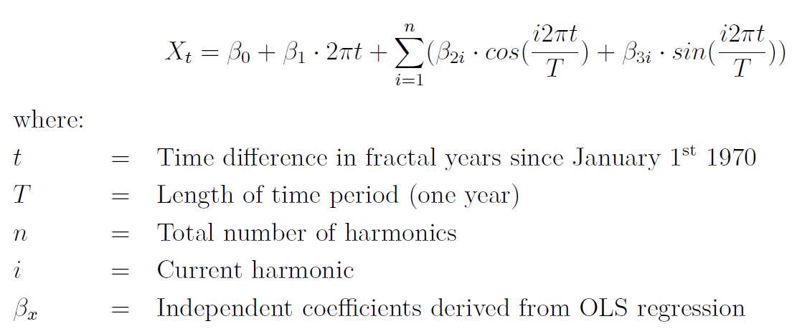
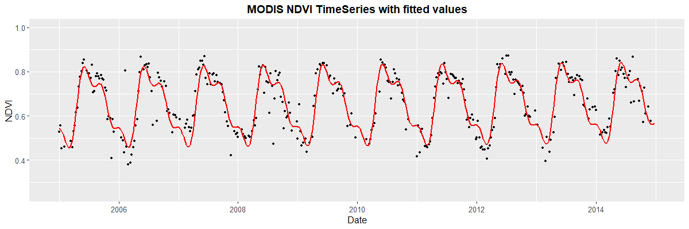

## rHarmonics
R package for harmonic modelling of time-series data.


To calculate the harmonic fitted curve of a periodic signal, ordinary least squares regressions were computed using coupled sine and cosine curves on time-series data. The underliying algorithm which is based Shumway, R. H., & Stoffer, D. S. (2017) equations 4.1 - 4.2 can be seen below:



## Installation

To install the current version, use `devtools`.

```R
devtools::install_github("MBalthasar/rHarmonics")
```

## Available Functions

The following functions are currently available and tested on Windows 10.

* `harmonics_fun()` This function enables the user to model different number of cycles per year for a given time series data set.

## Example

In this example a fitted curve using three cylces per year based on a NDVI MODIS timeseries is computed:

```R
library(ggplot2)

# Load sample NDVI time-series data.frame
ndvi_df <- base::readRDS(system.file(package = "rHarmonics",
                                     "extdata", "MODIS_NDVI_TimeSeries.rda"))

# Apply harmonic function using 3 cycles per year
fitted_3rd_deg <- harmonics_fun(user_vals <- ndvi_df$ndvi,
                                user_dates = ndvi_df$dates,
                                harmonic_deg <- 3)

# Combine fitted values with original df
combined_df <- cbind(ndvi_df, fitted_3rd_deg)
names(combined_df) <- c("dates", "ndvi", "fitted")

# Plot original data with fitted values
ggplot2::ggplot() +
  geom_point(data=combined_df, aes(x = dates, y = ndvi), color='black', size=1) +
  geom_line(data=combined_df, aes(x = dates, y = fitted), colour = "red", size=1)+
  labs(title="MODIS NDVI TimeSeries with fitted values", x="Date", y="NDVI") +
  theme(plot.title = element_text(hjust = 0.5, face="bold", size=14),
        axis.text=element_text(size=10),
        axis.title=element_text(size=12),
        legend.title=element_text(size=13, face="bold"),
        legend.text=element_text(size=13))+
  ylim(0,1)
```



The function can also be applied on a multi-layer raster stack to create a cloud-interpolated psuedo times-series data set:

```R
# Apply harmonic function on multi-layer raster file

library(raster)

# Load sample cloud- and snow-free MODIS TimeSeries
sample_raster <- raster::brick(system.file(package = "rHarmonics",
                                           "extdata",
                                           "MODIS_NDVI_stack.tif"))

fitted_raster <- raster::calc(sample_raster,
                              function(x){
                                 harmonics_fun(x, user_dates = ndvi_df$dates,
                                               harmonic_deg = 3)
                              })
```

## Literature
Shumway, R. H., & Stoffer, D. S. (2017). Time series analysis and its applications: with r examples. Springer.
